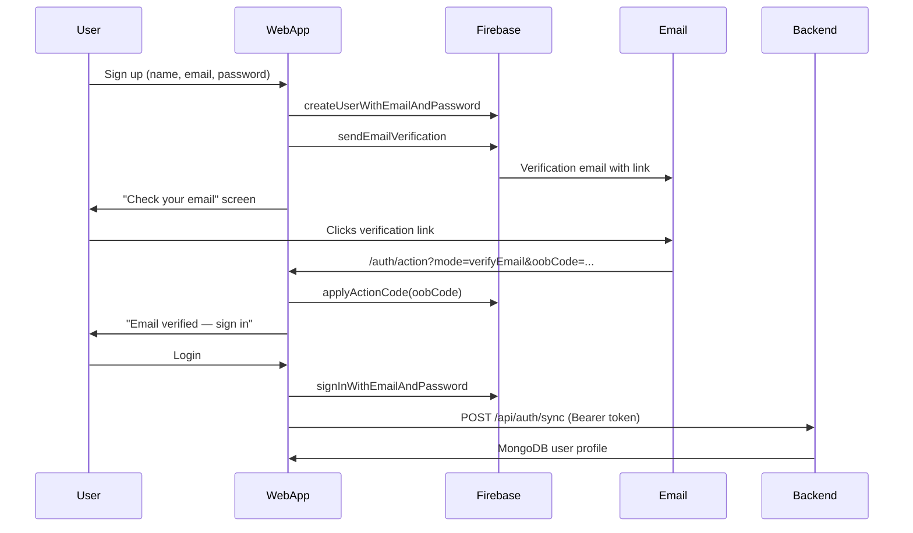
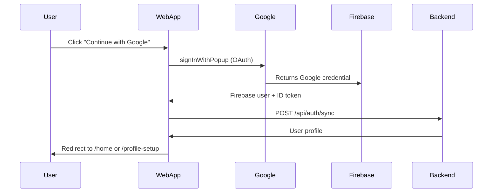

# Firebase Auth Setup Guide (Spoken Odyssey Web)

Your backend already uses Firebase Admin (`spoken-odesey` project). The web app needs the **client-side** Firebase Web config — this is different from the service account in `spokenOdessie_backend/.env.local`.

Copy `.env.example` to `.env.local` in `spoken-odyssey-web/` and fill in the values.

---

## 1. Get Firebase Web credentials

1. Open [Firebase Console](https://console.firebase.google.com) → project **spoken-odesey**
2. Click the gear icon → **Project settings**
3. Scroll to **Your apps** → if no web app exists, click **Add app** → **Web** (`</>`)
4. Copy these into `.env.local`:
   - `apiKey` → `NEXT_PUBLIC_FIREBASE_API_KEY`
   - `authDomain` → `NEXT_PUBLIC_FIREBASE_AUTH_DOMAIN`
   - `projectId` → `NEXT_PUBLIC_FIREBASE_PROJECT_ID`
   - `appId` → `NEXT_PUBLIC_FIREBASE_APP_ID`
   - `messagingSenderId` → `NEXT_PUBLIC_FIREBASE_MESSAGING_SENDER_ID`

---

## 2. Enable sign-in providers

Firebase Console → **Authentication** → **Sign-in method**

### Email/Password
- Enable **Email/Password**
- (Optional) Enable **Email link** — not required; we use verification links via `sendEmailVerification`

### Google
- Enable **Google**
- Set a support email (required)
- Firebase auto-creates an OAuth client for localhost in dev

---

## 3. Authorized domains

Firebase Console → **Authentication** → **Settings** → **Authorized domains**

Ensure these are listed:
- `localhost` (for dev)
- Your production domain when you deploy (e.g. `spokenodyssey.com`)

---

## 4. Email verification — how it works



**Manual settings for email links**

In Firebase Console → **Authentication** → **Templates**:
- Customize **Email address verification** template (optional branding)
- The link redirects to your app at `/auth/action` because we set:
  ```js
  { url: "http://localhost:3000/auth/action", handleCodeInApp: true }
  ```

**Important:** After deploying, update `NEXT_PUBLIC_APP_URL` to your production URL so email links point to the live site.

---

## 5. Password reset — how it works

1. User enters email on **Forgot password** (`/auth?mode=reset` view)
2. App calls `sendPasswordResetEmail` with continue URL `/auth/action`
3. User clicks link in email → `/auth/action?mode=resetPassword&oobCode=...`
4. User sets new password on the **Set New Password** form
5. Redirect to `/auth` to sign in

Customize template: Firebase Console → **Authentication** → **Templates** → **Password reset**

---

## 6. Google Sign-In — how it works + manual settings



**Manual settings**

1. Firebase Console → **Authentication** → **Sign-in method** → **Google** → Enable
2. For **production**, add your domain to:
   - Firebase **Authorized domains**
   - [Google Cloud Console](https://console.cloud.google.com) → **APIs & Services** → **Credentials** → OAuth 2.0 Client (auto-created by Firebase) → add authorized JavaScript origins and redirect URIs for your production URL
3. **localhost** works out of the box for development — no extra Google Cloud setup needed for local dev

**Note:** Google accounts are automatically email-verified, so they skip the verification screen.

---

## 7. Backend connection

Ensure backend is running:

```bash
cd spokenOdessie_backend
npm run dev   # runs on PORT=5001 per your .env.local
```

Frontend `.env.local`:

```
NEXT_PUBLIC_API_BASE_URL=http://localhost:5001
```

The backend verifies Firebase ID tokens and syncs users to MongoDB. No login/signup API routes exist on the backend — that is by design.

---

## 8. Quick test checklist

- [ ] Sign up → receive verification email → click link → `/auth/action` shows success
- [ ] Sign in with verified email → lands on `/home`
- [ ] Sign in before verifying → blocked with resend option
- [ ] Forgot password → email link → set new password → login works
- [ ] Google sign-in → syncs user → lands on `/home`
- [ ] Logout from Settings → redirected to `/auth`
